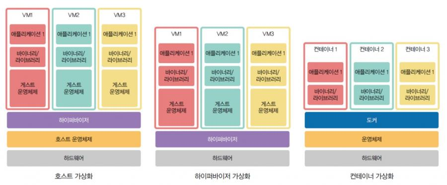

# 가상화

- 가상화는 물리적 컴퓨터 하드웨어를 보다 효율적으로 사용할 수 있도록 해주는 프로세스이며, 클라우드 컴퓨팅의 기반을 제공한다.
- 가상화는 소프트웨어를 사용하여 프로세스, 메모리, 스토리지 등과 같은 단일 컴퓨터의 하드웨어 요소를 일반적으로 가상머신(VM)이라고 하는 다수의 가상 컴퓨터로 분할할 수 있도록 해주는 컴퓨터 하드웨어 상의 추상화 계층을 구축한다.
- 가상화를 통해서 물리적인 서버를 늘리지 않고 필요에 따라 서버를 늘리거나 줄일 수 있다.

## 가상화의 종류

- 서버 가상화
  - 서버 가상화는 물리 서버를 가상화하는 것이다.
  - 가상 서버는 호스트 OS와 다른 OS를 구축할 수 있다.
  - 물리 서버의 사양이 높을 수롤 여러 가상 서버를 동시에 실행할 수 있다.
  - 물리 서버에 구축된 가상 서버는 네트워크를 통해 서로 참조할 수 있다.

- 네트워크 가상화
  - 네크워커 가상화는 네트워크 기기 및 네트워크 설비와 같은 물리적 네트워크 구성을 가상화하는 것이다.
  - 네트워크 하나를 여러 가상 네트워크로 나누거나 여러 네트워클 하나의 가상 네트워크로 보이게 할 수 있다.
  - 네크워크 가상화를 도입하면 물리적 네트워크 기기르 감추고 가상 스위치 등을 이용하여 네트워클 간단하게 관릴 수 있고 유연하게 변경할 수 있다.

- 스토리지 가상화, 데스크탑 가상화 등이 있다.

## 가상화의 장점과 단점

### 가상화의 장점

- 자원을 효율적으로 사용
- 비용 절감
- 운영 효율성 향상
- 재해 복구 및 백업 용이
- 테스트 및 개발 환경 제공
- 클라우드 컴퓨팅 지원

### 가상화의 단점

- 초기 투자 비용 증가
- 성능 저하
- 복잡한 관리
- 보안 위협
- 의존성 증가

## 서버 가상화

서버 가상화란 물리 서버 하나에 가상 서버를 여러 대 구축하는 기술이다.

### 서버 가상화의 종류

- 호스트 가상화(Host virtualization)
  - 운영체제를 설치한 후 하이퍼바이저를 통해 가상머신을 만들고 각 가상머신 내부에는 게스트 운영체제가 설치된다.
  - 가상머신 별로 OS가 설치되기 때문에 오버헤드가 있다
  - Virtual Box, VMWare, VM Workstation 등이 있다.
- 하이퍼바이저 가상화(Hypervisor virtualization)
  - 하이퍼바이저 가상화는 호스트 가상화와는 달리 호스트 운영체제를 필요로 하지 않는 방식이다.
  - 호스트 운영체제가 존재하지 않으므로 부팅 시 가상머신을 선택하게 된다.
  - 성능이 우수하다는 장점이 있지마, 초기 설정이 복잡하고 관리가 어려울 수 있다는 단점이 있다.
  - VMWare ESXi, Microsoft Hyper-V 등이 있다.
- 컨테이너 가상화(Container virtualization)
  - 운영체제 위에 컨테이너를 운영하기 위해 필요한 도커를 설치한 후 다수의 컨테이너를 통해 애플리케이션을 실행하는 방식이다.
  - 컨테이너 가상화 방식을 사용하면 컨테이너 간 격리가 되기 때문에 다른 애플리케이션에 영향을 미치지 않아 서로 다른 컴퓨팅 환경에서 애플리케이션을 실행할 수 있다.

### 가상화와 컨테이너의 차이점

|특징|가상화(VM)|컨테이너(Container)|
|---|---|---|
|기술적 원리|하드웨어 가상화|운영 체제 수준 가상화|
|격리성|높은 격리 (독립된 OS)|낮은 격리 (공유된 OS 커널)|
|자원 소모|상대적으로 무겁고 자원 소모 많음|경량화되어 자원 소모 적음|
|부팅 시간|수 분 소요|수 초 내외|
|이식성|제한적 (OS 및 하드웨어 의존)|매우 높음 (OS 및 플랫폼 독립적)|
|초기 구축 비용|비교적 높음|상대적으로 낮음|
|운영 사례|서버 통합, 다양한 OS 실행 환경|클라우드, 마이크로서비스, CI/CD|

## 컨테이너 가상화

- 컨테이너 가상화는 운영 체제 수준의 가상화 기술로, 애플리케이션과 그 실행 환경(라이브러리, 의존성 등)을 하나의 단위로 패키징하여 독립적이고 격리된 환경에서 실행할 수 있도록 하는 기술이다.
- 하이퍼바이저를 사용하는 전통적인 가상화와 달리, 컨테이너는 동일한 운영 체제 커널을 공유하면서 가볍고 빠르게 동작합니다.

### 컨테이너 가상화의 핵심 개념

- 운영 체제 수준의 가상화
  - 컨테이너 가상화는 하드웨어가 아닌 운영체제를 가상화한다.
  - 각각의 컨테이너는 OS 커널을 공유하지만, 독립된 파일 시스템, 네트워크, 프로세스 공간을 갖는다.
- 컨테이너와 이미지
  - 컨테이너(Container)
    - 실행 중인 애플리케이션의 인스턴스.
    - 격리된 환경에서 애플리케이션이 동작하며 필요한 라이브러리와 종속성을 포함.
  - 이미지(Image)
    - 컨테이너를 생성하기 위한 실행환경, 프로그램, 라이브러리 및 소스코드, 컴파일된 실행파일을 하나로 만들어 놓은 것
    - 실행 가능한 모든 환경을 포함하며, 컨테이너 엔진에서 이를 기반으로 컨테이너를 생성.
- 컨테이너 엔진
  - 컨테이너를 생성하고 관리하는 소프트웨어
  - Docker, Podman, Containerd 등이 있다.
- 커널 기능 활용
  - 컨테이너는 리눅스 커널의 **Cgroups(Control Groups)**와 Namespaces를 활용하여 자원 제한과 프로세스 격리를 구현.
  - Cgroups는 CPU, 메모리, 디스크 I/O 등 자원 사용량 제한
  - Namespaces는 파일시스템, 프로세스 ID, 네트워크 등을 컨테이너마다 격리

### 컨테이너 가상화의 특징

- 경량화
  - 운영 체제를 포함하지 않기 때문에 가상 머신보다 메모리, 디스크 용량이 적게 소모.
  - 일반적으로 컨테이너는 몇 MB의 크기, VM은 수 GB의 크기.
- 빠른 시작
  - 컨테이너는 OS 부팅 과정을 거치지 않고, 이미 실행 중인 커널을 활용하기 때문에 즉시 시작 가능.
- 이식성
  - 애플리케이션과 그 실행 환경을 포함하는 이미지는 어디서나 동일하게 실행 가능.
- 격리된 환경
  - 각 컨테이너는 다른 컨테이너와 독립적으로 동작하며, 문제가 발생해도 다른 컨테이너에 영향을 주지 않음.
- 운영체제 공류
  - 동일한 커널을 사용하므로 가상화 기술에 비해 자원 활용이 효율적.
