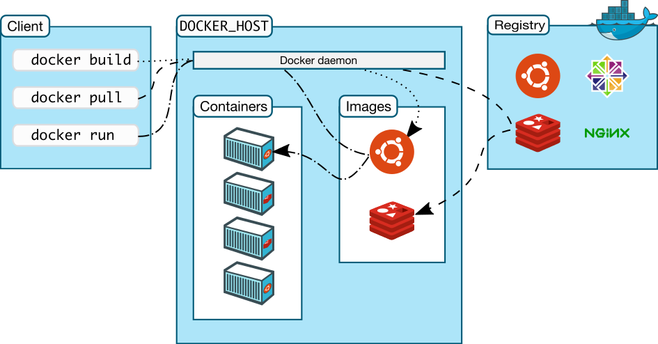
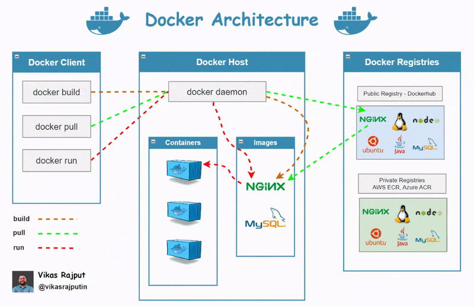

# 도커

Docker는 컨테이너 기반의 애플리케이션 가상화 플랫폼이다. 애플리케이션과 그 실행 환경을 패키징하여 격리된 상태에서 실행할 수 있게한다. Docker는 간단하고 일관된 배포를 가능하게 하며, 빠른 애플리케이션 개발과 배포를 지원한다.

- Docker 기술은 Linux 커널과 Cgroups 및 네임스페이스 등 커널의 기능을 사용하여 프로세스를 분리함으로써 독립적으로 실행할 수 있도록 한다.

- 도커는 컨테이너를 실행하거나 컨테이너 이미지를 만들고 배포하는 플랫폼이다.
- 도커는 응용 프로그램을 실행 환경 단위로 패키지화해 컨테이너 이미지를 만든다.
- 컨테이너 이미지는 컨테이너 레지스트리를 통해 개발 환경에서 운영 환경으로 배포할 수 있다.
- 실행 환경별로 패키지화하기 때문에 개발이나 운영 환경에서 동일한 환경에서 응용 프로그램을 실행할 수 있다.

## 도커 아키텍처

- 프로세스를 격리방식의 가상화다.
- CPU나 메로리를 프로세스마다 필요한 만큼 추가로 사용할 수 있다.
- 다른 가상화 방식에 비해서 성능 손실이 거의 없다.
- 프로세스 단위로 격리된 각각의 컨테이너는 서로 영향을 주지 않는다.
- 컨테이너는 1-2초 내로 빠르게 생성하고 실행할 수 있다.

### 주요 구성 요소

Docker 아키텍처는 클라이언트-서버 모델(Client-Server Architecture)을 기반으로 설계되어 있다.  
주요 구성 요소로 Docker 클라이언트, Docker 데몬, Docker 이미지, 컨테이너, 네트워크 및 볼륨이 포함된다.



- Docker 클라이언트(Docker Client):
  - 사용자가 Docker를 제어하기 위해 사용하는 인터페이스.
  - 명령어를 통해 Docker 데몬과 통신.
- Docker 데몬(Docker Daemon)
  - Docker 서버 역할을 수행하며, 컨테이너 생성, 시작, 중지 등 실제 작업을 처리.
  - 클라이언트 명령을 수신하고, 컨테이너 및 이미지를 관리.
  - Unix 소켓 또는 REST API를 통해 Docker 클라이언트와 통신.
- Docker 이미지(Docker Image):
  - 컨테이너를 실행하기 위한 실행 환경과 애플리케이션을 포함한 정적인 템플릿.
  - 레이어(layer) 기반으로 구성되어 효율적 저장 및 배포 가능.
  - 베이스 이미지(Base Image)와 사용자 정의 레이어(Custom Layer)로 구성.
- Docker 컨테이너(Docker Container):
  - 실행 중인 Docker 이미지의 인스턴스.
  - 애플리케이션과 필요한 종속성을 포함하며, 격리된 환경에서 동작.
  - 가볍고 빠르게 생성 및 삭제 가능.
- Docker 레지스트리(Docker Registry):
  - Docker 이미지를 저장하고 배포하는 중앙 저장소.
  - Docker Hub(공개 레지스트리)와 사설 레지스트리를 사용할 수 있음.
  - docker pull 명령으로 이미지를 다운로드, docker push 명령으로 업로드 가능.
- Docker 네트워크:
  - 컨테이너 간 통신을 가능하게 하는 가상 네트워크.
  - Docker는 다양한 네트워크 드라이버를 제공:
  - bridge: 기본 네트워크, 컨테이너 간 통신 가능.
  - host: 호스트 네트워크와 공유.
  - overlay: 여러 Docker 호스트 간의 네트워크 구성.
- Docker 볼륨(Docker Volume):
  - 컨테이너에서 데이터를 저장하거나 공유하기 위한 스토리지 메커니즘.
  - 컨테이너를 삭제해도 데이터 유지 가능.



## 도커 실습 환경 구성하기

1. 도커 데스크탑 설치하기 : [도커데스크탑 홈](https://www.docker.com/products/docker-desktop/) 에서 ```Docker Desktop``` 다운받아서 설치한다.
2. 아래의 명령어르 실행해서 설치를 확인한다.

```cmd
C:\Users\jhta? docker version

  Client:
  Version:           27.2.0
  API version:       1.47
  Go version:        go1.21.13
  Git commit:        3ab4256
  Built:             Tue Aug 27 14:17:17 2024
  OS/Arch:           windows/amd64
  Context:           desktop-linux

  Server: Docker Desktop 4.34.2 (167172)
  Engine:
    Version:          27.2.0
    API version:      1.47 (minimum version 1.24)
    Go version:       go1.21.13
    Git commit:       3ab5c7d
    Built:            Tue Aug 27 14:15:15 2024
    OS/Arch:          linux/amd64
    Experimental:     false
  containerd:
    Version:          1.7.20
    GitCommit:        8fc6bcff51318944179630522a095cc9dbf9f353
  runc:
    Version:          1.1.13
    GitCommit:        v1.1.13-0-g58aa920
  docker-init:
    Version:          0.19.0
    GitCommit:        de40ad0
```

## 도커 이미지(Docker Image)와 도커 컨테이너(Docker Container)

- 도커 이미지
  - 도커 이미지는 **컨테이너를 만드는데 사용되는 읽기 전용 템플릿**이다.
  - 컨테이너 실행에 필요한 파일과 설정값 등을 포함하고 있는 도커파일을 만든 후 **Dockerfile을 빌드**하여 이미지를 만든다.
- 도커 컨테이너
  - 도커 컨테이너는 **도커 이미지를 실행한 상태**다.
  - 도커 이미지로 도커 컨테이너를 생성하면 이미지의 목적에 맞는 파일이 들어있는 파일 시스템과 격리된 시스템 자원 및 네트워크를 사용할 수 격리된 실행환경이 생성된다.
  - 도커 이미지는 도커 컨테이너를 만드는 레시피에 해당하기 때문에 **하나의 도커 이미지를 여러 개의 도커 컨테이너**를 만들고 실행할 수 있다.

### 도커 이미지

#### 도커 이미지란 무엇인가?

- 정의
  - 도커 이미지(Docker Image)는 애플리케이션 실행에 필요한 파일과 설정을 포함하는 읽기 전용 템플릿이다.
- 특징
  - 읽기 전용 구조를 가진다.
    - 실행 가능한 컨테이너를 생성하기 위한 기본 단위이다.
    - 도커 이미지는 읽기 전용 상태로 설계된다.
    - 컨테이너가 실행되면, 도커는 이미지 위에 쓰기 가능한 레이어(컨테이너 레이어)를 추가하여 데이터 변경을 허용하지만, 이미지 자체는 변경되지 않는다.
  - 계층 구조를 가진다.
    - 도커 이미지는 여러 계층(Layer)로 구성된다.
      - Base Image -> 애플리케이션 -> 설정 파일
    - 각 계층은 독립적으로 관리되며, 변경 사항은 새로운 계층으로 기록된다.
    - 이미 존재하는 계층은 재사용 가능하므로, 효울적인 저장과 배포가 가능하다.
  - 가볍다.
    - 도커 이미지는 기본적으로 필요 최소한의 환경만 포함한다.
    - 경량화를 위해 일반적으로 Alpine Linux(5M 미만 크기)와 같은 경량 베이스 이미지를 사용한다.
  - 재사용성
    - 이미지 계층 구조 때문에 변경되지 않는 계층은 다시 다운로드하지 않고 재사용한다.
  - 이식성
    - 이미지 파일만 있으면 어떤 환경에서든지 컨테이너를 생성하고 실행할 수 있다.
    - 개발 환경과 운영 환경의 차이를 최소화하여 **DevOps** 환경에서 특히 유용하다.
  - 효율적인 배포
    - 도커 허브와 같은 레지스트리를 통해 이미지를 쉽게 공유하고 배포할 수 있다.
    - 계층 기반 배포 방식은 변경된 레이어만 전송하므로 네트워크 효율이 매우 높다.
  - 보안성
    - 도커 이미지는 읽기 전용이므로, 컨테이너 레벨에서 발생하는 문제는 이미지에 영향을 주지 않는다.

  

### 도커 파일(Dockerfile)

- 도커 이미지를 생성하기 위한 스크립트 파일이다.
- 자체 DSL(Domain-specific language) 언어를 사용해서 도커 이미지 생성 과정을 기술한다.
- 사용자가 원하는 애플리케이션 환경을 정의하고 이를 기반으로 도커 이미지를 생성하게 한다.
- 도커 파일은 텍스트 파일로 작성된다.

#### 도커 파일 예제

```Dockerfile
# 베이스 이미지로 java 17버전이 포함된 도커이미지를 사용한다.
FROM openjdk:17-jdk-alpine

# 메이븐을 이용해서 프로젝트를 패키징 한다.
CMD ["./mvnw", "clean", "package"]

# 메이븐으로 패키징된 jar파일의 위치와 파일명을 JAR_FILE 변수에 설정한다.
ARG JAR_FILE=target/*.jar

# JAR_FILE 변수에 지정된 파일을 app.jar라는 이름으로 컨테이너에 추가한다.
COPY ${JAR_FILE} app.jar

# 컨테이너가 사용할 포트번호를 설정한다.
EXPOSE 8080

# 컨테이너가 실행될 때 기본적으로 실행될 명령어를 설정한다.
# 이 경우에는 app.jar 자바 애플리케이션을 실행한다.
ENTRYPOINT ["java","-jar","/app.jar"]
```

#### 도커파일 문법

|명령어|설명|사용법 예시|
|---|---|---|
|```FROM```|도커 이미지 빌드의 기반이 되는 이미지를 지정한다|```FROM ububutu:20.04```|
|```WORKDIR```|명령러 실행 및 컨테이너 시작 시 사용할 작업 디렉토리를 지정한다. 이 후에 실행되는 모든 명령어는 해당 디렉토리를 기준으로 실행된다.|```WORKDIR /usr/src/app```|
|```RUN```|이미지를 빌드할 때 명령어를 실행하고, 실행 결과를 이미지에 저장합니다. 보통은 이미지 안에 특정 소프트웨어를 설치하기 위해서 사용한다.|```RUN apt-get update && apt install -y nginx```|
|```ENTRYPOINT```|컨테이너 실행 시 항상 실행되어야 하는 ***고정 명령어***를 지정합니다. ```CMD```와 달리 컨테이너 실행시 고정적으로 샐된다.|```ENTRYPOINT ["java","-jar","/app.jar"]```|
|```CMD```|도커 이미지로 컨테이너 시작될 때 실행된다. Dockerfile에 하나만 사용할 수 있다. ```docker run```명령어로 덮어쓸 수 있다. |```CMD ["node", "app.js"]```|
|```EXPOSE```|컨테이너로 들어오는 들어오는 요청을 리스닝하는 포트를 지정한다.|```EXPOSE 80```|
|```COPY```|```COPY``` 명령문은 호스트 컴퓨터에 있는 디렉토리나 파일을 도커 이미지의 파일 시스템으로 복사한다.|```COPY ${JAR_FILE} app.jar```|
|```ENV```|환경변수를 설정하기 위해서 사용한다. ```ENV```로 설정한 환경변수는 이미지 빌드과정 및 컨테이너에서 실행되는 애플리케이션에서도 사용할 수 있다.|```ENV NODE_ENV production```|
|```ARG```|도커 이미지를 빌드할 때 ```--build-arg <varname>=<value>``` 플래그를 사용해서 전달한 값을 변수로 저장할 때 사용한다. 빌드과정에서 아무값도 전달하지 않으면 설정된 기본값을 사용하도록 한다. |```ARG JAR_FILE=target/*.jar```|
|```VOLUME```|데이터 볼륨을 지정한다.|```VOLUME /data```|
