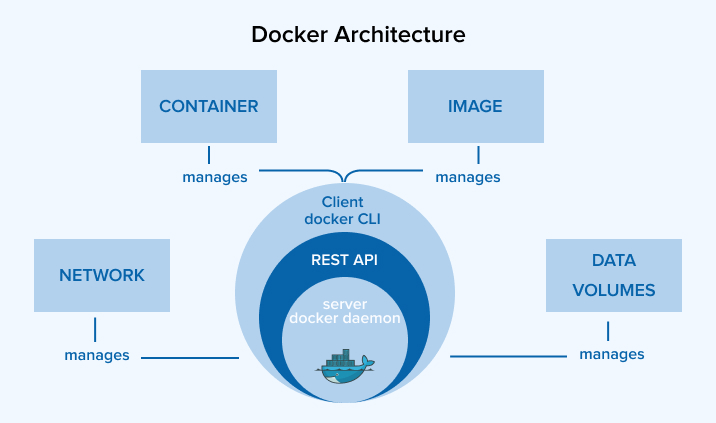

# 도커

Docker는 컨테이너 기반의 애플리케이션 가상화 플랫폼으로, 애플리케이션과 그 실행 환경을 패키징하여 격리된 상태에서 실행할 수 있도록 도와줍니다. Docker는 간단하고 일관된 배포를 가능하게 하며, 빠른 애플리케이션 개발과 배포를 지원합니다.

- 도커는 컨테이너를 실행하거나 컨테이너 이미지를 만들고 배포하는 플랫폼이다.
- 도커는 응용 프로그램을 실행 환경 단위로 패키지화해 컨테이너 이미지를 만든다.
- 컨테이너 이미지는 컨테이너 레지스트리를 통해 개발 환경에서 운영 환경으로 배포할 수 있다.
- 실행 환경별로 패키지화하기 때문에 개발이나 운영 환경에서 동일한 환경에서 응용 프로그램을 실행할 수 있다.

## 도커 아키텍처

- Docker 아키텍처는 클라이언트-서버 모델(Client-Server Architecture)을 기반으로 설계되어 있다.
- 주요 구성 요소로 Docker 클라이언트, Docker 데몬, Docker 이미지, 컨테이너, 네트워크 및 볼륨이 포함된다.

### 주요 구성 요소

- Docker 클라이언트(Docker Client):
  - 사용자가 Docker를 제어하기 위해 사용하는 인터페이스.
  - 명령어를 통해 Docker 데몬과 통신.
- Docker 데몬(Docker Daemon)
  - Docker 서버 역할을 수행하며, 컨테이너 생성, 시작, 중지 등 실제 작업을 처리.
  - 클라이언트 명령을 수신하고, 컨테이너 및 이미지를 관리.
  - Unix 소켓 또는 REST API를 통해 Docker 클라이언트와 통신.
- Docker 이미지(Docker Image):
  - 컨테이너를 실행하기 위한 실행 환경과 애플리케이션을 포함한 정적인 템플릿.
  - 레이어(layer) 기반으로 구성되어 효율적 저장 및 배포 가능.
  - 베이스 이미지(Base Image)와 사용자 정의 레이어(Custom Layer)로 구성.
- Docker 컨테이너(Docker Container):
  - 실행 중인 Docker 이미지의 인스턴스.
  - 애플리케이션과 필요한 종속성을 포함하며, 격리된 환경에서 동작.
  - 가볍고 빠르게 생성 및 삭제 가능.
- Docker 레지스트리(Docker Registry):
  - Docker 이미지를 저장하고 배포하는 중앙 저장소.
  - Docker Hub(공개 레지스트리)와 사설 레지스트리를 사용할 수 있음.
  - docker pull 명령으로 이미지를 다운로드, docker push 명령으로 업로드 가능.
- Docker 네트워크:
  - 컨테이너 간 통신을 가능하게 하는 가상 네트워크.
  - Docker는 다양한 네트워크 드라이버를 제공:
  - bridge: 기본 네트워크, 컨테이너 간 통신 가능.
  - host: 호스트 네트워크와 공유.
  - overlay: 여러 Docker 호스트 간의 네트워크 구성.
- Docker 볼륨(Docker Volume):
  - 컨테이너에서 데이터를 저장하거나 공유하기 위한 스토리지 메커니즘.
  - 컨테이너를 삭제해도 데이터 유지 가능.

